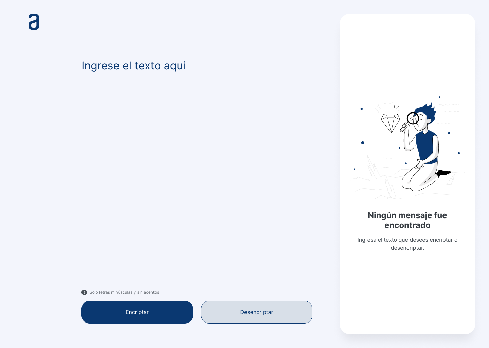
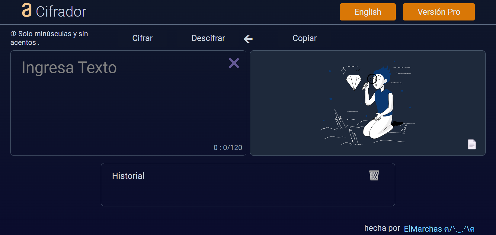
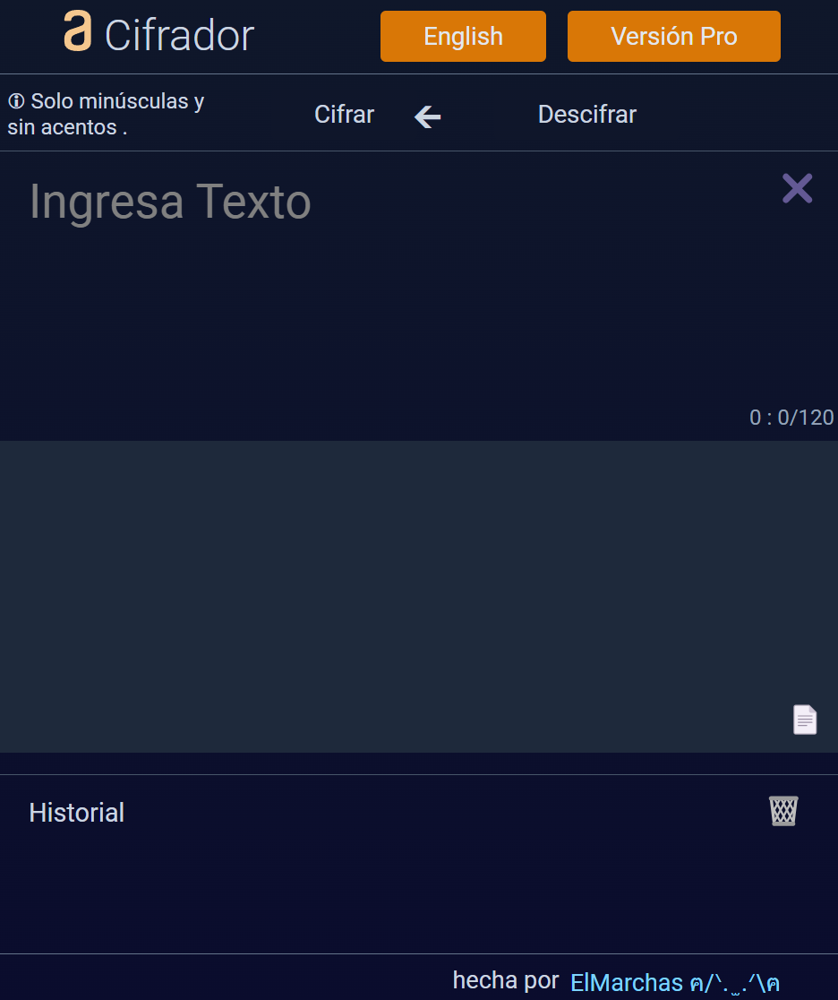

# Encriptador alura  

Este repositorio es un intento de resolver el [desafío encriptador](https://www.aluracursos.com/challenges/challenge-one-logica/sprint01-construye-un-encriptador-texto-con-javascript) propuesto en alura. 

Tenemos un periodo de tiempo de cuatro semanas para desarrollar el proyecto **(del 25 de enero 2024 al 25 febrero 2024)** y la pagina tiene que estar alojada en GitHub Pages. 

## Requisitos 
### Mecánica encriptación 

Debe convertir las vocales a palabras especificadas como se muestra a continuación y viceversa. 

``` 
"a" => "ai" 

"e" => "enter" 

"i" => "imes" 

"o" => "ober" 

"u" => "ufat" 
``` 

Contar con validaciones antes de ejecutar y un botón para copiar el texto al portapapeles. 

### Validaciones 

- Debe funcionar solo con letras minúsculas. 

- No deben ser utilizados letras con acentos ni caracteres especiales. 

- Debe ser posible convertir una palabra para la versión encriptada también devolver una palabra encriptada para su versión original. 

### Elementos de interfaz 

- Título de su sitio web 

- Campo para el texto que va a ser encriptado/desencriptado 

- Un botón para encriptar 

- Un botón para desencriptar 

- Área para mostrar el texto encriptado/desencriptado. 

- Un botón que copie el texto encriptado/desencriptado para la sección de transferencia. 

- Un rodapié con los datos de la persona que desarrolló el sitio web! 

### Referencias de interfaz 

 

 

## Resultados 
### interfaz 

Se optó por un fondo negro por mera estética, además se cambiaron los botones a la parte superior para facilitar su uso en pantallas pequeñas. Los campos de texto cuentan con márgenes que delimitan su área. Un recuadro de historial en la parte inferior para llenar el espacio vacío. 

 

 

### funcionalidad 

Además de las mecánicas requeridas para el reto se agregaron un par más para experimentar más propiedades del JS. 

Se agrego un botón swap (🡰) para pasar el texto del campo de salida al campo de entrada y agilizar el cifrado múltiple. 

Se agrego un botón borrar (✖️) para eliminar el texto del campo de entrada de una forma más eficiente. 

Se agrego un campo de historial donde se almacenan las ultimas 15 consultas, con sus respectivos botones de borrado global y por elemento. 

Se agrego un botón de idioma para cambiar entre el español y el inglés si así se requiere. Para ello se utilizó un objeto para almacenar los dos idiomas disponibles. 

Se agrego un botón Pro, para implementar el cifrado en tiempo real cada que se introduce un carácter en el campo del input. Además de retirar las limitaciones iniciales sobre mayúsculas y caracteres especiales. 

### notas 

en el modal se podría usar el node para los diferentes párrafos, pero no tiene caso al no ser funcional sino meramente conceptual. Caso contrario en el log si usamos el node para los estilos de cada entrada tipo chat para facilitar el uso del botón eliminar de cada elemento del arreglo. 

#### Personas que salvaron el proyecto 

Para obtener la posición del cursor [Soubriquet](https://stackoverflow.com/a/54333903) 

Para establecer la posición del cursor [Todo el hilo](https://stackoverflow.com/questions/36869503/set-caret-position-in-contenteditable-div-that-has-children) 

Para manejar los regex [regexone](https://regexone.com/) 

Para probar los regex [regexr](https://regexr.com/3g3qf) 

 