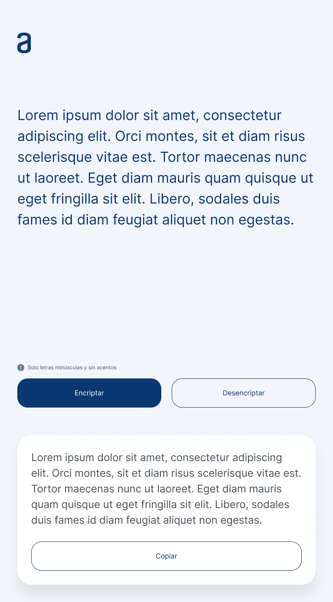

# Encriptador alura

Este repositorio es un intento de resolver el [desafio encriptador](https://www.aluracursos.com/challenges/challenge-one-logica/sprint01-construye-un-encriptador-texto-con-javascript) propuesto en alura.

Tenemos un periodo de tiempo de cuatro semanas para desarrollar el proyecto **(del 25 de enero 2024 al 25 febrero 2024)** y la pagina tiene que estar alojada en github pages.

## Requisitos

### Mecanica encriptacion

Debe convertir las vocales a palabras especificadas como se muestra a continuacion y viceversa.

```
"a" => "ai"
"e" => "enter"
"i" => "imes"
"o" => "ober"
"u" => "ufat"
```

Contar con validaciones antes de ejecutar y un boton para copiar el texto al portapapeles.

### Validaciones

- Debe funcionar solo con letras minúsculas.
- No deben ser utilizados letras con acentos ni caracteres especiales.
- Debe ser posible convertir una palabra para la versión encriptada también devolver una palabra encriptada para su versión original.

### Elementos de interfaz

- Título de su sitio web
- Campo para el texto que va a ser encriptado/desencriptado
- Un botón para encriptar
- Un botón para desencriptar
- Área para mostrar el texto encriptado/desencriptado.
- Un botón que copie el texto encriptado/desencriptado para la sección de transferencia.
- Un rodapie con los datos de la persona que desarrolló el sitio web!

### Referencias de interfaz





## Resultados

AUN FALTA HACER LA CORRECCION DE ORTOGRAFIA PORQUE NO SE ESCRIBIR SÉÉÉÉÉÉ
nadota, que weba redactar estas cosas. yo ni se escribir

en el modal se podria usar el node para los diretentes parrafos, pero no tiene caso al no ser funcional sino meramente conceptual. por otro lado en el log si usamos el node para los estilos de cada entrada tipo chat
